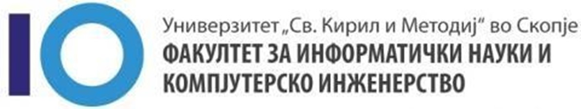

# Домашна работа број 1

**Предмет:** Дизајн и архитектура на Софтвер

**Автори:**
1. Драган Велинов (211245)
2. Дејви Величковски (202032)
3. Мартина Климоска (195011)
4. Јован Александроски (211248)
5. Синиша Бошковски (201158)

## VinoFindMK

VinoFindMK е апликацијата за вистинските љубители на вино. Оваа апликација ви помага да ги пронајдете и искусите разновидните вина и долгата традиција на правење вино во нашата богата земја. Со нашата апликација можете да ги истражите сите региони и градови кои се бават во правење на вино.

Апликацијата е совршена и за тие што се љубители на специфични видови на вино, бидејќи можете да бирате винарии и по типот на вино што го произведуваат. За да можете подобро да се одлучите која винара е за вас можете да ги искористите филтрите, за тип на вино, регионот кај е продуцирано. Покрај тоа ви овозможуваме да ги видите менита на различните винари, нивниот рејтинг или коментари за нив оставени од други корисници на апликацијата кои ги имаат посетено.

## Функционални барања

- Системот треба да овозможи локационо пребарување
- Системот треба да овозможи интерактивна мапа
- Системот треба да овозможи филтрирање и сортирање
- Системот треба да овозможи детали за место
- Системот треба да овозможи кориснички рецензии
- Системот треба да овозможи кориснички оценки
- Системот треба да овозможи насоки
- Системот треба да овозможи апдејтирање на податоците на секој 24 часа

## Нефункционални барања

- Системот треба да овозможи капацитет од 100,000 корисници
- Системот треба да овозможи приказ на сите винарии во Македонија
- Системот треба да ги прикаже сите винарии во рок од 2 секунди
- Системот треба да е едноставен за користење
- Системот треба да подржува повеќе веб прелистувачи
